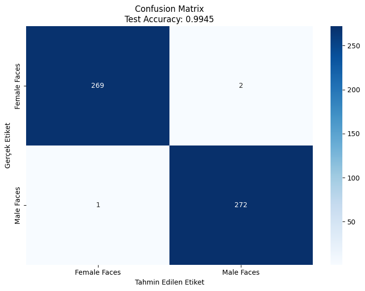
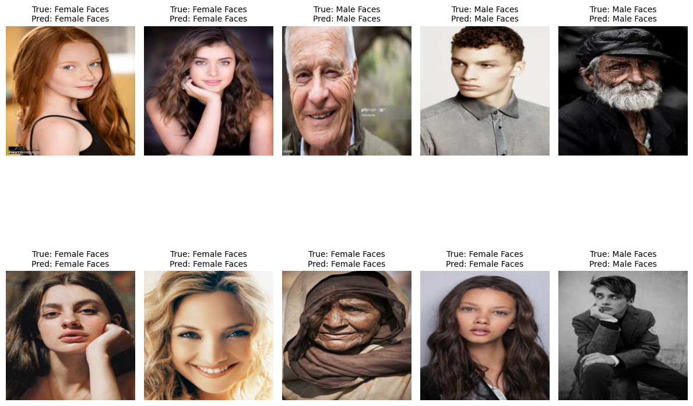
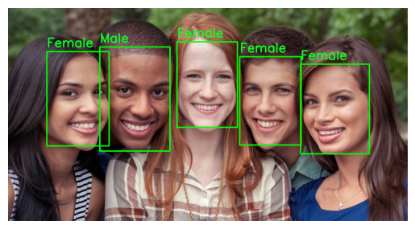

# Face Detection and Classification with ResNet50 and OpenCV

Bu proje, PyTorch ve OpenCV kullanarak yüz tanıma ve sınıflandırma (cinsiyet tahmini) modeli oluşturmayı hedeflemektedir. 

---

## İçindekiler

- [Proje Hakkında](#proje-hakkında)
- [Kurulum](#kurulum)
- [Veri Seti](#veri-seti)
- [Model](#model)
- [Eğitim](#eğitim)
- [Test ve Değerlendirme](#test-ve-değerlendirme)
- [Yüz Tespiti (OpenCV)](#yüz-tespiti-opencv)
- [Kullanım](#kullanım)
- [Sonuçlar](#sonuçlar)
- [İletişim](#iletişim)

---

## Proje Hakkında

Bu projede, özel bir görüntü veri seti kullanılarak ResNet50 modeli eğitilmiştir. Model, yüz görüntülerini kullanarak cinsiyet tahmini yapmaktadır. Ayrıca OpenCV kullanılarak gerçek görüntülerde yüz tespiti yapılmakta ve tespit edilen yüzler model tarafından sınıflandırılmaktadır.

---

## Kurulum

Projeyi çalıştırmak için aşağıdaki Python paketlerini yükleyin:

```bash
pip install torch torchvision matplotlib seaborn tqdm scikit-learn opencv-python pillow
```

---

## Veri Seti

- Veri seti, sınıflara göre klasörlenmiş yüz görüntülerinden oluşmaktadır.
- `train`, `val` ve `test` olmak üzere üç ayrı klasör yapısı vardır.
- Her klasör içinde sınıf isimlerine göre alt klasörler bulunur (örn. `Male`, `Female`).
- `CustomImageDataset` sınıfı ile bu klasör yapısından veri yükleme işlemi yapılmaktadır.

---

## Model

- Önceden eğitilmiş **ResNet50** modeli kullanılmıştır.
- Modelin son katmanı, veri setindeki sınıf sayısına göre yeniden düzenlenmiştir.
- Loss fonksiyonu olarak **CrossEntropyLoss**, optimizer olarak **Adam** kullanılmıştır.

---

## Eğitim

- Model `train` ve `val` veri setleri üzerinde eğitilmiştir.
- Eğitim sürecinde her epoch sonunda eğitim ve doğrulama kayıpları ile doğrulukları hesaplanır.
- En iyi doğrulama kaybına sahip model `FaceDetection_best.pth` olarak kaydedilir.
- Tüm epochlardan sonra son model `FaceDetection_last.pth` olarak kaydedilir.
- Eğitim sırasında ilerleme barı için `tqdm` kullanılmıştır.

---

## Test ve Değerlendirme

- Eğitilen model test veri setinde değerlendirilmiştir.
- Test sonucu kayıp (loss) ve doğruluk (accuracy) hesaplanmıştır.
- Confusion matrix oluşturularak modelin sınıflandırma performansı görselleştirilmiştir.
- Rastgele seçilen 10 test görüntüsü ve tahmin sonuçları matplotlib ile gösterilmiştir.

---

## Yüz Tespiti (OpenCV)

- OpenCV'nin hazır **Haar Cascade** yüz detektörü kullanılarak görüntülerde yüz tespiti yapılmaktadır.
- Tespit edilen yüzler kırpılarak model ile sınıflandırılır.
- Sınıflandırmaya göre yüz çevresine farklı renklerde dikdörtgen çizilir (örneğin, erkek için mavi, kadın için pembe).

---

## Kullanım

1. Veri setinizi `train_dir`, `val_dir`, `test_dir` değişkenlerine yol olarak atayın.
2. `train_model()` fonksiyonunu çağırarak modeli eğitin.
3. `FaceDetection_best.pth` dosyasını kullanarak modeli test edin.
4. OpenCV yüz tespiti ve sınıflandırma kodu ile gerçek görüntülerde tahmin yapabilirsiniz.

---

## Sonuçlar

- Model, test veri setinde yüksek doğruluk oranına ulaşmıştır.
- Confusion matrix ve görselleştirmelerle modelin performansı değerlendirilebilir.






- OpenCV ile entegre yüz tespiti ile gerçek zamanlı uygulamalara uyarlanabilir.



---

## İletişim

Herhangi bir sorunuz veya öneriniz için bana ulaşabilirsiniz.

---

*Bu proje, PyTorch ve OpenCV kullanarak yüz tanıma ve sınıflandırma üzerine hazırlanmıştır.*
